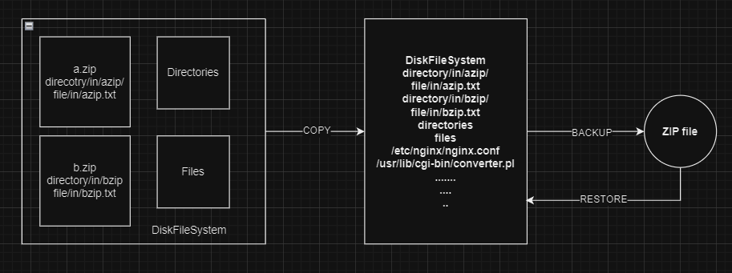

# simplefu
simple file util for resp.me deployments.

Designed with a focus on reliability and convenience, rather than performance or scalability, this solution is particularly suitable for automation tasks involving file movement, copying, or backup operations.



## Usage
file list file copy-always.txt, files in this list will always be copied to the destination even if the file already exists.

```text
/some/path/tofile/a.txt -> /another/path/
/some/path/tozipfile/a.zip!x/y/z.txt -> /another/path/
/some/path/tozipfile/a.zip!~y.txt -> /another/path/
```

file list file copy-if-missing.txt will only copy when the destination file is missing.
```text
/some/path/tofile/a.txt -> /another/path/
/some/path/tozipfile/a.zip!x/y/z.txt -> /another/path/
/some/path/tozipfile/a.zip!~y.txt -> /another/path/
```
! split will extract the exactly file from the zip archive, !~ will extract the first file endswith the name.

## command
copy files;
```bash
java -jar simplefu.jar copy --copy-always filelistfile.txt --copy-if-missing filelistfile.txt
```

backup all the files about copy to.
```bash
java -jar simplefu.jar backup --backup-to some.zip file-list-file1, file-list-file2 ...
```
restore files at the destination

```bash
java -jar simplefu.jar backup --restore-from some.zip file-list-file1, file-list-file2 ...
```
